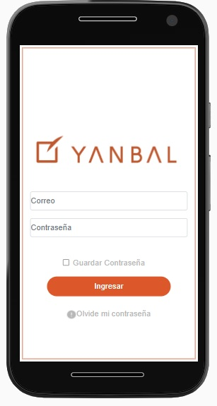
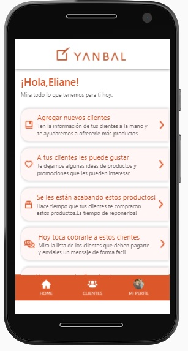
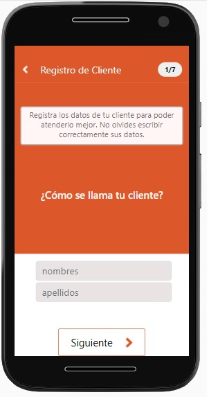
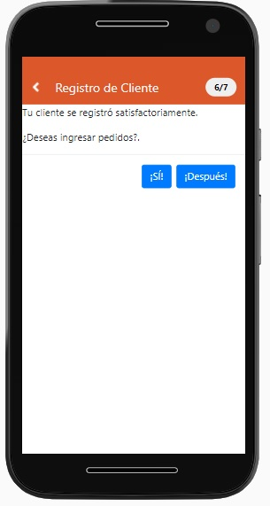
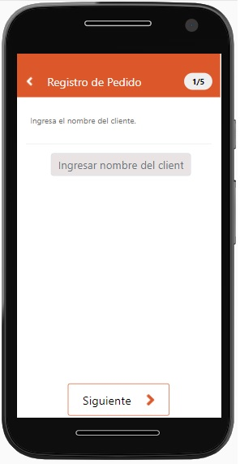
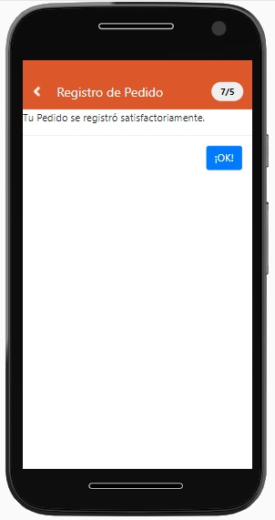
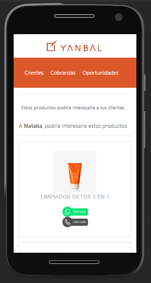

# MAYACLIENTES-YANBAL USANDO react.js
Maya Clientes, es un app desarrollada en react,sass,bootstrap usando firebase como backend. Tiene como objetivo que los y las consultoras de Yanbal puedan gestionar a sus clientes de manera rápida y sobre todo ordenada. 
Este producto digital permitirá a las y los consultores registrar a sus clientes para conectar con ellos y  lograr fidelizarlos, mediante sus preferencias e historial de compra de productos. 
A continuación detallaremos las funcionalidades y secciones de Maya clientes:
- Recompra: Al registrar los pedidos de sus clientes, MAYA podrá enviarles una alerta cuando estos estén próximos a agotarse, en consecuencia las consultoras podrán tener ventas efectivas y además hará que sus clientes sientan una atención personalizada de parte de su asesora de belleza.
- Oportunidades: MAYA ayudará haciendo recomendaciones de ofertas orientada en base a las compras anteriores registradas por las y los consultores.
- Historial de compras: Registro de pedidos donde las y los consultores podrán ir agregando los productos solicitados por sus clientes, esta información alimentará distintas bases de datos que ayudarán a que MAYA. Clientes pueda ofrecer información valiosa y sobre todo a tiempo.
- Cobranzas: Ayudará a que las y los consultores lleven un control de las deudas de sus clientes, registrando los productos vendidos e inclusive estableciendo fechas de pago.

## Contenido del proyecto.
Este proyecto tiene tres ramas: gh-pages, main y sabidevelop. **main** Contiene los ultimos cambios listos para desplegar **gh-pages** Es la rama donde corre el proyecto desplegado y **sabidevelop** Contiene las modificaciones que se realizan en el proyecto.

### LOGIN 
Al iniciar se podrá encontrar la primera vista de login , donde el usuario se registra.



### HOME 
En esta vista la consultora y/o consultor encontrará opciones donde podrá navegar:



Opción 1: "Agregar nuevos clientes"

Se podrá registrar:
- Nombres



- Apellidos
- Correo electrónico
- Teléfono
- Fecha de cumpleaños
- Preferencias y 
- Comentarios adicionales. Para en un futuro ofrecerle más productos.

1.1 Si da clic en ¡SÍ! se le pedirá ingresar: 




- Nombre del cliente




- Monto de pedido
- Monto a cobrar
- Fecha de pago
- Producto al final solo dando clic en el botón "OK" el pedido ya registrará con éxito.




Opción 2: "A tus clientes le puede gustar"




Muestra una lista de productos a fines al cliente, con el propósito de poder ofrecerlos vía llamada o mensaje de "WhatsApp", el mismo que enviará un mensaje automático con las características del producto directo al número del cliente.


## Prototipo de alta fidelidad

Este es el enlace a figma : https://www.figma.com/file/wFChCLZbyIIy1ltyeEZ8Ht/Maya-Clientes-Yanbal?node-id=120%3A3763

## Prerequisitos

Necesitará las siguientes programas instaladas correctamente en su computadora

- [Git](https://git-scm.com/)
- [Node.js](https://nodejs.org/)
- [Chrome](https://google.com/chrome/)
- [Visual Studio Code](https://code.visualstudio.com/)

## Demo
Mediante este enlace podrán visualizar la demo de este proyecto desplegada en gh-pages [Demo del proyecto](https://sumaqkuyay.github.io/mayaclientes-yanbal/#/)

## Instalación del proyecto
Se tienen requisitos especiales,siga estos pasos.

## Forquear el proyecto.

## Clonar el proyecto
```bash
git clone https://github.com/sumaqkuyay/mayaclientes-yanbal.git
```
### Instalar las dependencias
Para instalar las dependencias escriba lo siguiente y ejecute
```bash
npm install
```
#### Ejecutar el proyecto
Para ejecutar el proyecto escriba lo siguiente y ejecute
```bash
npm start
```

## Despliegue del proyecto
Para desplegar el proyecto es necesario ubicarse en la rama **main** y ejecutar lo siguiente:
```bash
npm run deploy
```

# Licencia
[MIT](LICENSE).
This project was bootstrapped with [Create React App](https://github.com/facebook/create-react-app).

*** 
## Available Scripts

In the project directory, you can run:

### `npm start`

Runs the app in the development mode.<br />
Open [http://localhost:3000](http://localhost:3000) to view it in the browser.

The page will reload if you make edits.<br />
You will also see any lint errors in the console.

### `npm test`

Launches the test runner in the interactive watch mode.<br />
See the section about [running tests](https://facebook.github.io/create-react-app/docs/running-tests) for more information.

### `npm run build`

Builds the app for production to the `build` folder.<br />
It correctly bundles React in production mode and optimizes the build for the best performance.

The build is minified and the filenames include the hashes.<br />
Your app is ready to be deployed!

See the section about [deployment](https://facebook.github.io/create-react-app/docs/deployment) for more information.

### `npm run eject`

**Note: this is a one-way operation. Once you `eject`, you can’t go back!**

If you aren’t satisfied with the build tool and configuration choices, you can `eject` at any time. This command will remove the single build dependency from your project.

Instead, it will copy all the configuration files and the transitive dependencies (webpack, Babel, ESLint, etc) right into your project so you have full control over them. All of the commands except `eject` will still work, but they will point to the copied scripts so you can tweak them. At this point you’re on your own.

You don’t have to ever use `eject`. The curated feature set is suitable for small and middle deployments, and you shouldn’t feel obligated to use this feature. However we understand that this tool wouldn’t be useful if you couldn’t customize it when you are ready for it.

## Learn More

You can learn more in the [Create React App documentation](https://facebook.github.io/create-react-app/docs/getting-started).

To learn React, check out the [React documentation](https://reactjs.org/).

### Code Splitting

This section has moved here: https://facebook.github.io/create-react-app/docs/code-splitting

### Analyzing the Bundle Size

This section has moved here: https://facebook.github.io/create-react-app/docs/analyzing-the-bundle-size

### Making a Progressive Web App

This section has moved here: https://facebook.github.io/create-react-app/docs/making-a-progressive-web-app

### Advanced Configuration

This section has moved here: https://facebook.github.io/create-react-app/docs/advanced-configuration

### Deployment

This section has moved here: https://facebook.github.io/create-react-app/docs/deployment

### `npm run build` fails to minify

This section has moved here: https://facebook.github.io/create-react-app/docs/troubleshooting#npm-run-build-fails-to-minify
