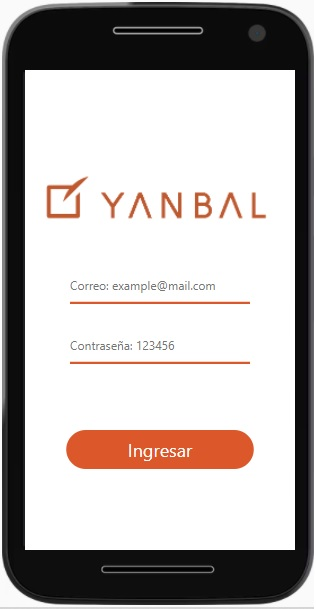
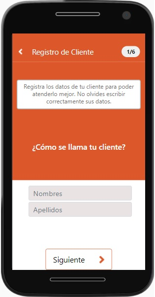
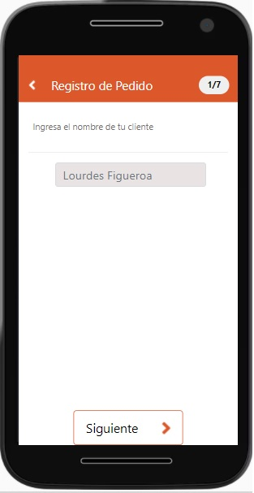
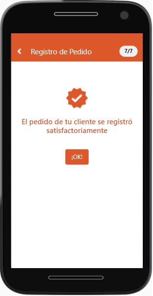

# MAYACLIENTES - YANBAL
Maya Clientes, es un app desarrollada en React, Sass, Bootstrap usando firebase como backend. Tiene como objetivo que los y las consultoras de Yanbal puedan gestionar a sus clientes de manera rápida y sobre todo ordenada. 

A continuación detallaremos las funcionalidades y secciones de Maya clientes:

- Registro: Este producto digital permitirá a las y los consultores registrar a sus clientes para conectar con ellos y  lograr fidelizarlos, mediante sus preferencias e historial de compra de productos. 

- Historial de compras: Registro de pedidos donde las y los consultores podrán ir agregando los productos solicitados por sus clientes, esta información alimentará distintas bases de datos que ayudarán a que MAYA Clientes pueda ofrecer información valiosa y sobre todo a tiempo.

- Oportunidades: MAYA ayudará haciendo recomendaciones de ofertas orientada en base a las compras anteriores registradas por las y los consultores.

- Cobranzas: Ayudará a que las y los consultores lleven un control de las deudas de sus clientes, registrando los productos vendidos e inclusive estableciendo fechas de pago.

## Contenido del proyecto.

### LOGIN 
Al iniciar se podrá encontrar la primera vista de login , donde el usuario se registra.

### HOME 
En esta vista la consultora y/o consultor encontrará opciones donde podrá navegar:

Opción 1: "Agregar nuevos clientes"

Se podrá registrar:
- Nombres

- Apellidos
- Correo electrónico
- Teléfono
- Fecha de cumpleaños
- Preferencias y 
- Comentarios adicionales. Para en un futuro ofrecerle más productos.

Registrando así, al cliente con exito. Dando una opción adicional de ingresar pedidos en el momento.

Opción 2: "Registra pedidos para tus clientes!"

Se podrá registrar:
- Nombre del cliente

- Monto de pedido
- Monto a cobrar
- Fecha de pago
- Productos 
  
  Registrando así, el pedido con éxito.

Opción 3: "A tus clientes les puede gustar"

Muestra una lista de productos a fines al cliente, con el propósito de poder ofrecerlos.

Los productos son ofrecidos vía llamada o mensaje de "WhatsApp", el mismo que enviará un mensaje automático con las características del producto, directamente al número del cliente.

## Prototipo de alta fidelidad

Enlace a figma : https://www.figma.com/file/wFChCLZbyIIy1ltyeEZ8Ht/Maya-Clientes-Yanbal?node-id=120%3A3763
